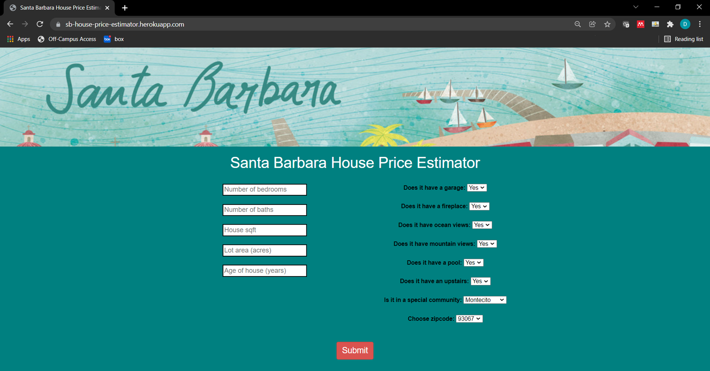
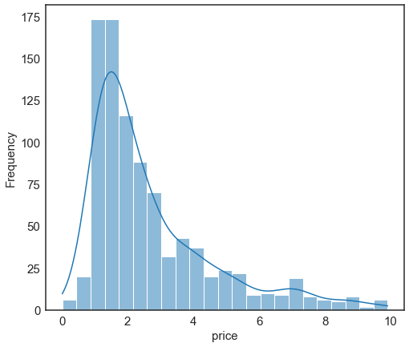
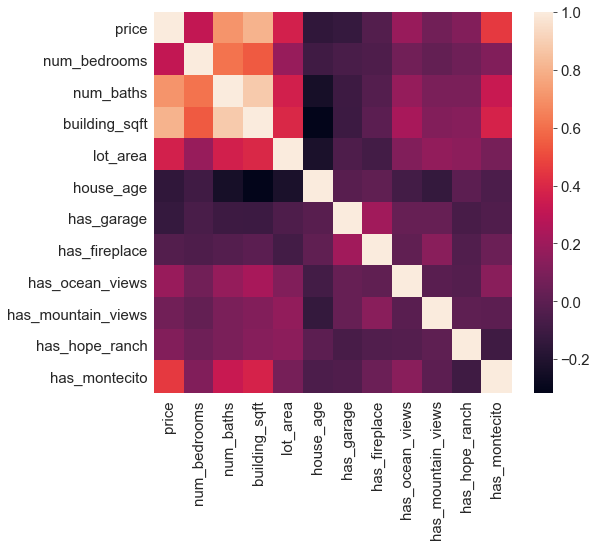
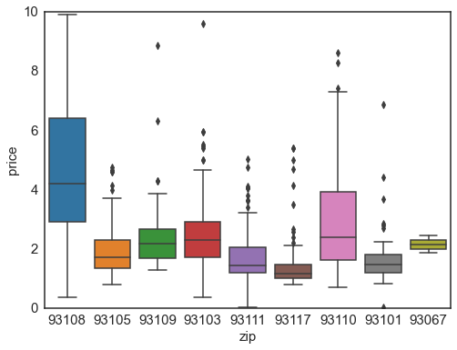
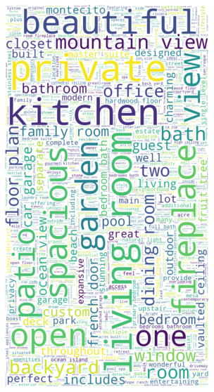
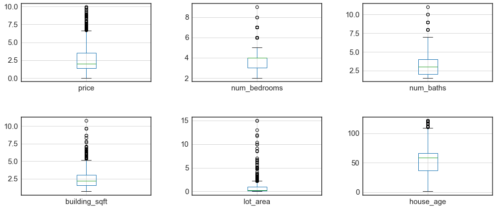
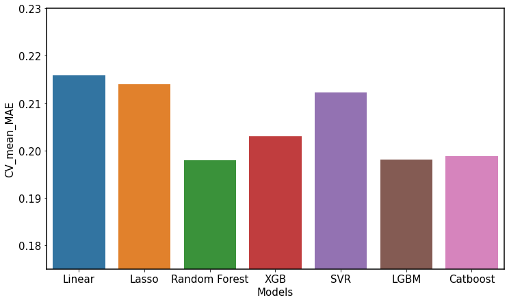
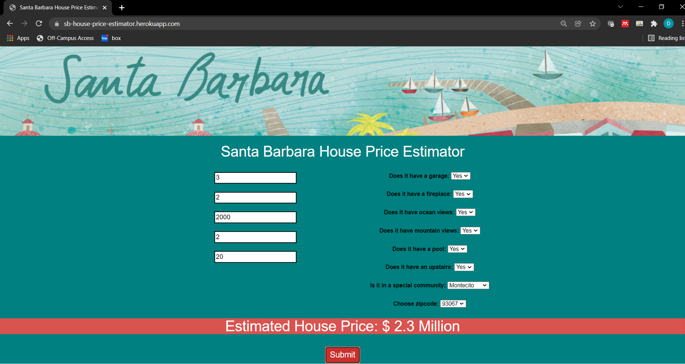

# Santa Barbara Real Estate Price Estimator

  

### Web App Link: http://ec2-54-151-126-133.us-west-1.compute.amazonaws.com/

## Overview
* Built a web scraper from scratch to scrape data from ~1500 single family homes that have been sold over the past 2 years in Santa Barbara from trulia.com
* Created SQLite database 
* Engineered features from the written house description to quantify the value of certain house attributes such as "ocean views", "pool", "fireplace", etc. 
* Implemented various feature engineering strategies such as scaling, normalization, transformation, one hot encoding, KNN imputation, etc
* Optimized hyper parameters for linear, lasso, random forest, LightGBM, Catboost, and XGboost
* Built a flask API endpoint for estimating a house price based on features
* Wrote a web application in HTML, CSS, and JavaScript to display price prediction based on user input and hosted on an AWS EC2 instance

## Resources
**Python version:** 3.8

**Packages:** sqlite3, pandas, numpy, sklearn, Catboost, LightGBM, seaborn, requests, beautifulsoup, flask, pickle

**Languages:** python, SQLite, JavaScript, HTML, CSS

## Web Scraping
* Built a web scraper from scratch using python and beautiful soup to scrape data for ~1500 single family homes that have been sold in the past 2 years off of trulia.com
* Extracted features from each listing such as:
  - Closing price
  - Year built
  - Lot area
  - House sqft
  - Number of bedrooms/bathrooms
  - House description
  - House address
  - Sold date
* Stored raw data in SQLite database

## Data Cleaning and Feature Engineering
* Extracted features from the house description, such as the presence of key words/phrases such as "pool", "ocean views", "mountain views", "fireplace", etc.
* Converted "year built" to house age
* Extracted the zipcode from the address as a categorical variable
* Used one hot encoding to create dummy variables for categorical variables such as the zipcode
* Used a KNN regressor to impute missing values 
* Rescaled several variables to ensure that most features were on a similar scale
* Normalized the distribution of several variables with skewed distributions

## Exploratory Data Analysis
Used data visualization and basic summary statistics to analyze the distribution of variables, correlation between variables, outliers, data range, etc.

  

  
   
  

  
  
## Model Development
* I split the data into train and test sets (20% test) with the price as the target variable
* Due to the sparse nature of the dataset, I tried to choose models that work well with sparse data including normalized regression such as lasso, and tree based models. I evaluated the performance of 7 different models including:
  - Linear regression 
  - Lasso regression 
  - Support vector regression
  - Random forest
  - XGBoost
  - LightGBM
  - Catboost
* Used GridsearchCV to tune the hyperparameters of each model (when appropriate)
* Evaluated the performance of each model using 3 fold cross validation
* After comparing the MAE of each optimized model, the LightGBM model outperformed the other models 

  
## Model performance
The LightGBM model achieved an MAE of $0.42 million (about 15% of the mean price)

## Model Productionalization

  

* Created flask API endpoint to estimate a price based on input features
* Wrote a full stack web application in HTML, CSS, and JavaScript which takes in user input, calls the flask API, and displays the predicted price
* Hosted the web application on AWS EC2

## Future work
* This dataset was relatively limited in terms of sample size and number of features:
  - Add more features to the dataset via further feature engineering and web scraping
  - Increase the sample size (scrape data from more house listings)
* Further optimization of data cleaning and hyperparameter tuning is needed
* Improved error handling in the web app
